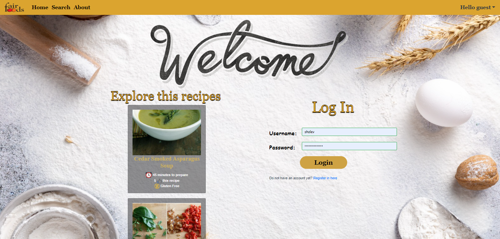
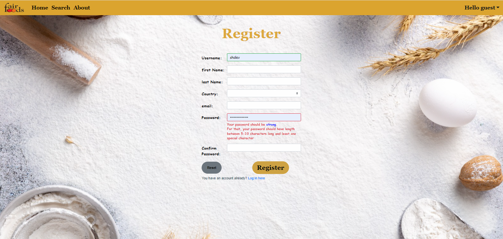
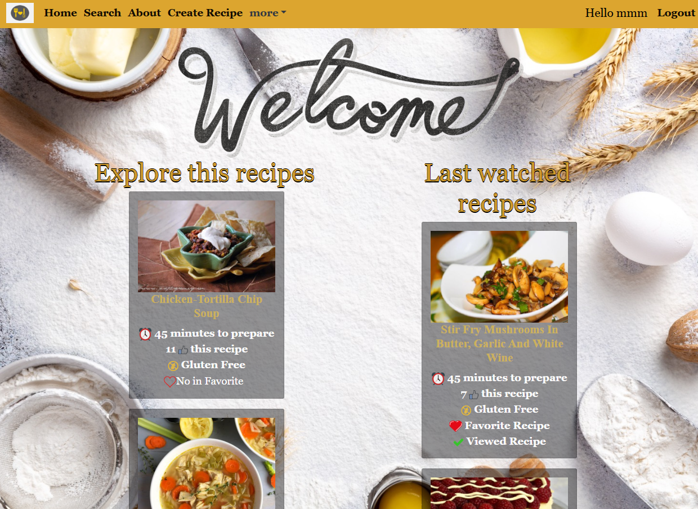
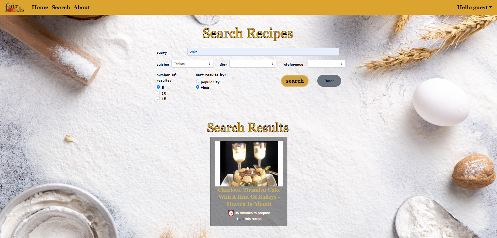
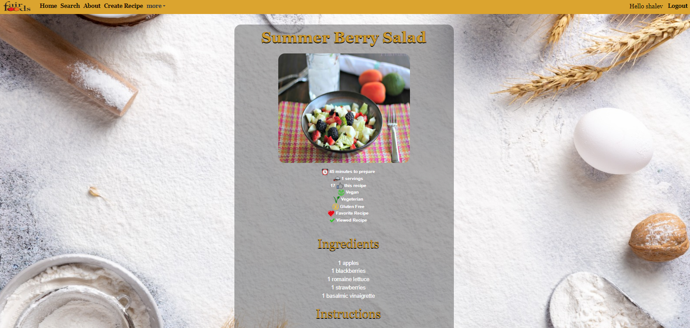

# 🍲 Grandma's Recipes 

A full-stack web application for discovering, saving, and managing personal recipes.

🌐 Live Website: [recipe-web-front.onrender.com](https://recipe-web-front.onrender.com/#/)

---

## 📌 Project Overview

**Grandma's Recipes** is a recipe management platform that allows users to:

- Search recipes using an external API (Spoonacular)
- View detailed recipe instructions and ingredients
- Create and save personal recipes
- Track progress while cooking

---

## 🛠️ Tech Stack

| Layer       | Technologies                                      |
|-------------|---------------------------------------------------|
| Frontend    | Vue.js, BootstrapVue, Axios, Vue Router           |
| Backend     | Node.js, Express                                  |
| Database    | MySQL (hosted via Railway)                        |
| External API| [Spoonacular Food API](https://spoonacular.com/) |
| Deployment  | Render (Frontend & Backend), Railway (Database)  |

---

## ✨ Main Features

### 🔍 Recipe Discovery
- Search recipes by name with filters for cuisine, diet, and intolerances
- Sort by preparation time or popularity
- Responsive recipe previews (image, title, time, tags, etc.)

### 📋 Full Recipe View
- Displays full ingredient list, steps, number of servings
- Navigation button to enter step-by-step cooking mode

### 👤 User Authentication & Personal Area
- User registration and login with validation
- Personal dashboard includes:
  - Favorite recipes
  - User-created recipes

### ✍️ Recipe Creation
- Modal-based form to create and submit new recipes
- Recipes are saved to the database and displayed in the user’s dashboard

---

## 🖼️ Screenshots & Demo
- 📷 Welcome Page with random recipes and login


- 📷 Register Page


- 📷 Home page with random and recently viewed recipes


- 📷 Search page with filters and results


- 📷 Full recipe page


---

## 🚀 Getting Started Locally

### 1. Clone the Repository
```bash
git clone https://github.com/ShalevMaimon/recipes_web.git
cd recipe_web
```

### 2. Install Dependencies

**Frontend:**
```bash
cd client
npm install
```

**Backend:**
```bash
cd ../server
npm install
```

### 3. Configure Environment Variables

Create a `.env` file in the `server/` directory:
```env
DB_HOST=your_mysql_host
DB_USER=your_mysql_user
DB_PASSWORD=your_mysql_password
DB_NAME=your_database_name
SESSION_SECRET=your_secure_secret
```

### 4. Run the App

**Backend:**
```bash
npm start
```

**Frontend:**
```bash
cd ../client
npm run serve
```

---

## 📬 Contact

For questions, feel free to contact us via GitHub Issues or email.
